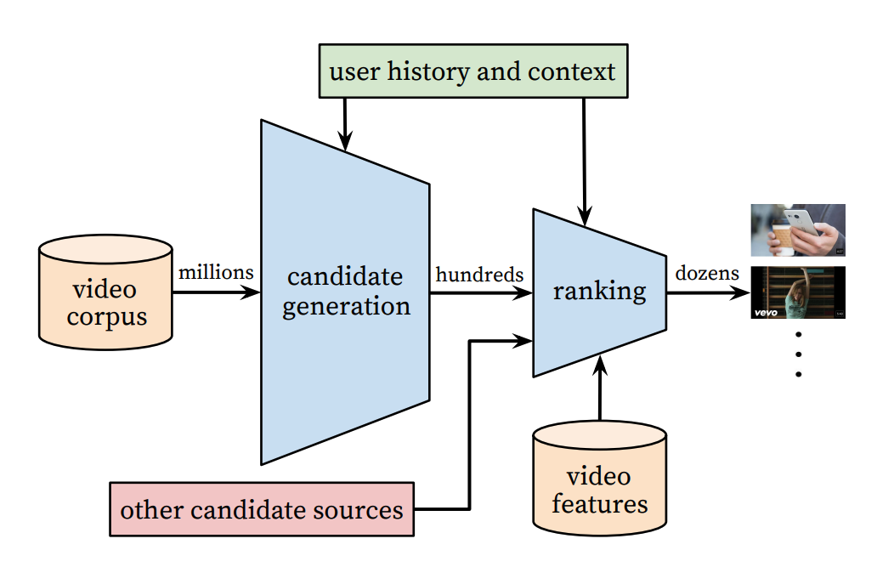
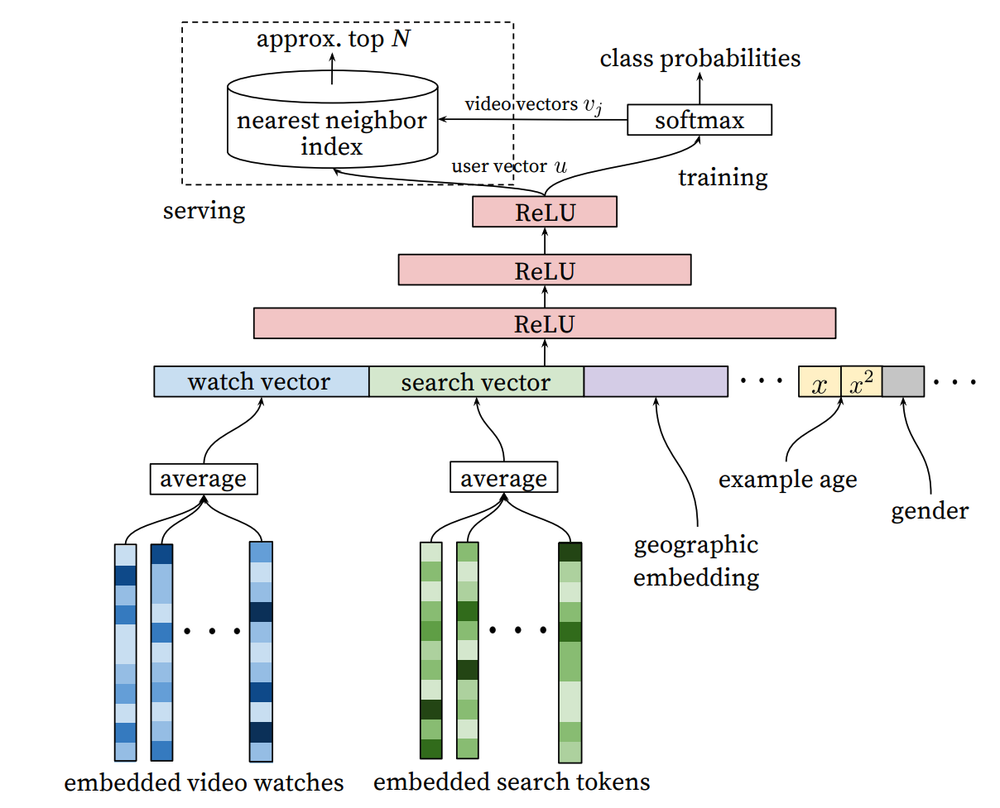

# Recommendation System 3639 Final Project
Final Project Paper Report in Recommendation System 3639 (Reichman University)
by Loten Noy and Gil-Ad Katz

<figure>

 <b>Figure 1:</b> General Deep Youtube Recommendations Model 

</figure>

  
This repository includes our report of the paper by:

_Paul Covington, Jay Adams, and Emre Sargin. 2016. Deep Neural Networks for YouTube Recommendations. In Proceedings of the 10th ACM Conference on Recommender Systems (RecSys '16). Association for Computing Machinery, New York, NY, USA, 191–198. https://doi.org/10.1145/2959100.2959190_

1. The report document with our analysis and innovations (pdf)
2. Our Implementation and Interpretation of the feature extraction practices suggested in the paper
3. Our implementation of the original `Candidate Generation` architecture model in PyTorch
4. Our Innovation of the original model in PyTorch
5. A notebook (`runner.ipynb`) set up to train both models + a baseline model on the MovieLens 100K dataset

<figure>

 <b>Figure 2:</b> Candidate Generation for Deep Youtube Recommendations Model 

</figure>

## Results
* The results of our experiments can be found in the report under "Experiments"

## Running the notebooks
* GPU is highly recommended
* The notebook is already configured with the best default hyperparameters for the dataset.
* If running on colab:
  * Zip the `src/` folder and upload to you running colab instance
  * Uncomment the `unzip` line in the notebook

### For the 100K notebook
1. Download the MovieLens 100K dataset https://grouplens.org/datasets/movielens/100k/
2. Extract it to a "datasets/ml-100k" folder next to the notebook (5 folds already provided as part of the dataset archive)
